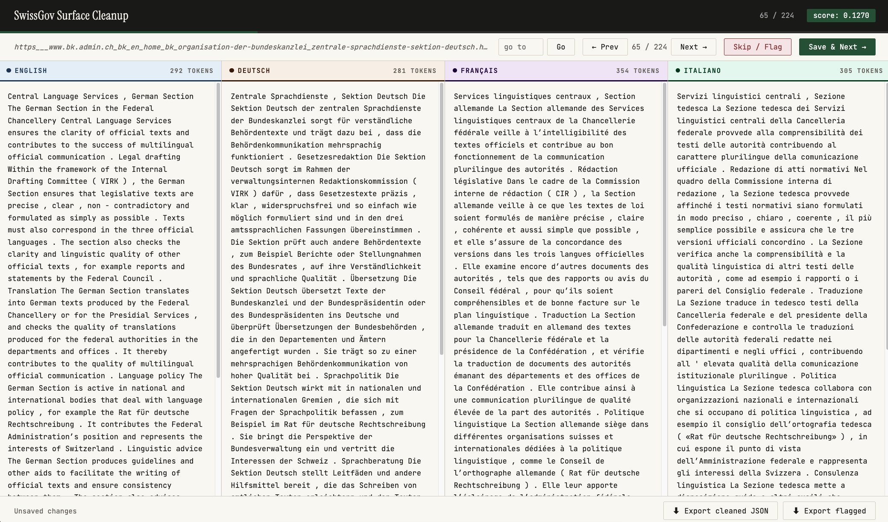

# SwissGov for Document-Level Translation Evaluation

This repository contains a subset of the SwissGov-RSD dataset ([Wastl et al., 2025](https://www.arxiv.org/abs/2512.07538)) optimized for document-level translation evaluation in a multi-parallel setting between English, French, German, and Italian.

* `swissgov_cleaned.json` contains the final multi-parallel documents, suitable for immediate use. These documents have been manually inspected for alignment quality. Sections that introduce semantic differences have been removed. Paragraph breaks have been re-inserted.
* `swissgov_sorted_by_diff_score.json` contains the unfiltered and unprocessed SwissGov documents sorted by difference score.
* `cleanup_tool.html` allows one to drag-and-drop a JSON file such as `swissgov_sorted_by_diff_score.json` to open a document in all language versions simultaneously and edit them as desired.

## Source Data

SwissGov-RSD is a human-annotated, document-level, cross-lingual dataset collected from the Swiss government portal admin.ch, which publishes content in parallel across German, French, Italian, and English (as well as Romansh to some extent). The full dataset comprises 224 multi-parallel documents annotated with token-level semantic differences on a five-point scale across three language pairs (EN-DE, EN-FR, EN-IT). Annotations distinguish between bilateral differences (spans labeled on both sides) and asymmetric differences (omissions or additions labeled on one side only). Find the original repo [here](https://github.com/ZurichNLP/SwissGov-RSD).

## Parallel Dataset Construction

### 1. Scoring Documents by Semantic Difference

To identify the cleanest translation pairs, each document is assigned a difference score that aggregates its token-level annotations into a single normalized value. The score is computed as follows.

**Weighted token counts.** Annotated tokens are grouped by their label value. Since the label range is `[0.2, 0.4, 0.6, 0.8, 1.0]`, each group receives a severity weight from 1 to 5 respectively. Label 1.0 is additionally doubled, since asymmetric annotations (omissions/additions) are only labeled on one side — doubling normalizes them to be comparable with bilateral labels, which are counted on both sides. This gives effective per-label weights of 1, 2, 3, 4, and 10.

**Aggregation.** The weighted counts across all label groups are summed into a single raw difference score per document.

**Length normalization.** The raw score is divided by the document length in tokens (measured on the English and other language side combined) to make scores comparable across documents of varying length.

**Averaging across languages.** Since every English file is paired with another language three times in the original SwissGov-RSD dataset, the difference scores for each pair are averaged into a single cross-lingual difference score.

The resulting score distribution:


Please refer to `parallel-swissgov.ipynb`for more details on score calculation.

### 2. Filtering by Difference Score

Document quadruples are ranked by their difference score and filtered based on a threshold determined by manual inspection. Documents were manually inspected from the lowest difference score in ascending order to determine the threshold after which the documents are considered semantically and structurally too different to be included as strictly multi-parallel documents. Observations reveal the following:

* <0.127: effectively equivalent texts (64 document quadruples)
* ~0.127–0.268: + small phrasing differences, minor explicitations
* ~0.268–0.506: + pronounced reformulations, restructuring, and explicitations
* \>0.506: + almost certainly major structural divergences, with whole paragraphs missing or completely rewritten

To facilitate comparison and editability of a sample across all languages the `cleanup_tool.html`has been created with the help of Claude:



## Benchmarking Machine Translation Systems
TODO
- apertus v1
- tower
- hunyuan
- translategemma

## Citation

If you use this repo or dataset, please cite the original SwissGov-RSD paper:
```bibtex
@misc{wastl2025swissgovrsdhumanannotatedcrosslingualbenchmark,
      title={SwissGov-RSD: A Human-annotated, Cross-lingual Benchmark for Token-level Recognition of Semantic Differences Between Related Documents}, 
      author={Michelle Wastl and Jannis Vamvas and Rico Sennrich},
      year={2025},
      eprint={2512.07538},
      archivePrefix={arXiv},
      primaryClass={cs.CL},
      url={https://arxiv.org/abs/2512.07538}, 
}
```


